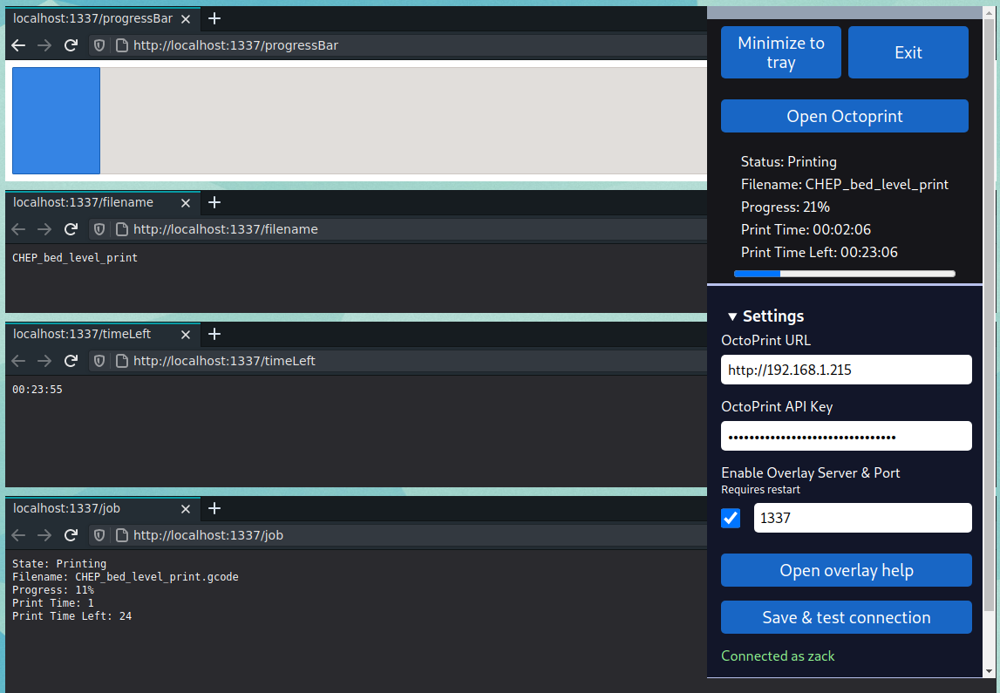

# OctoPrint OBS Tray

WIP!

An [Electron](https://electronjs.org/) app to sit in your system tray and provide at a glance info for your current [OctoPrint](https://octoprint.org/) job. Optional simple http server to serve stats for an OBS Browser Overlay source.

## Download

See [GH Releases](https://github.com/zackboe/octoprintOBSTray/releases) for prebuilt binaries

